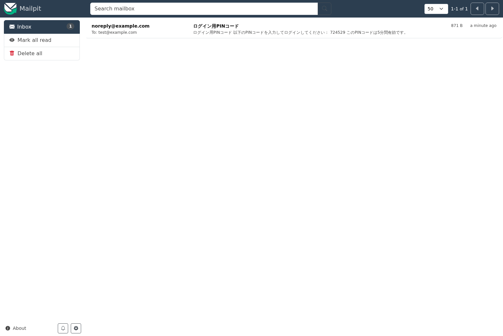
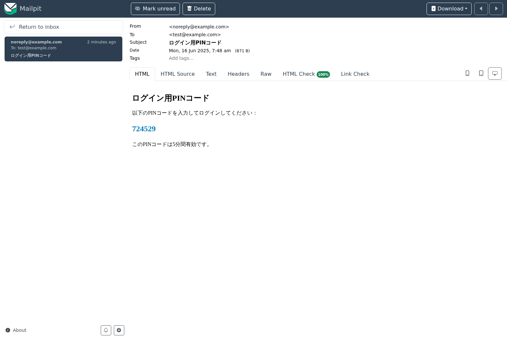
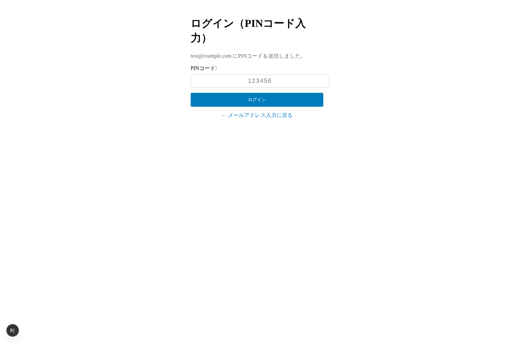
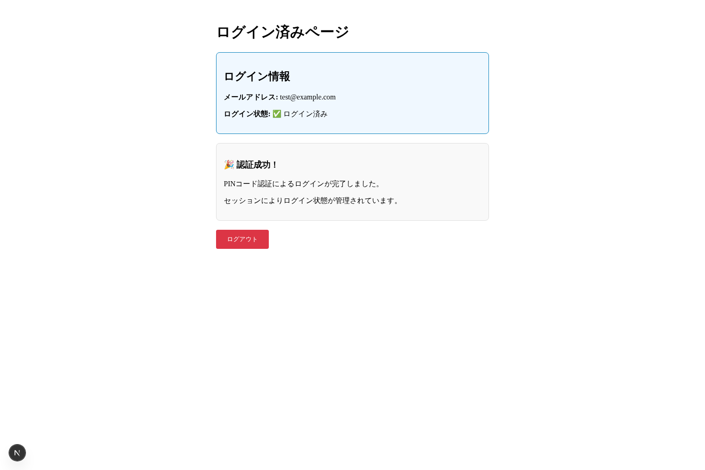
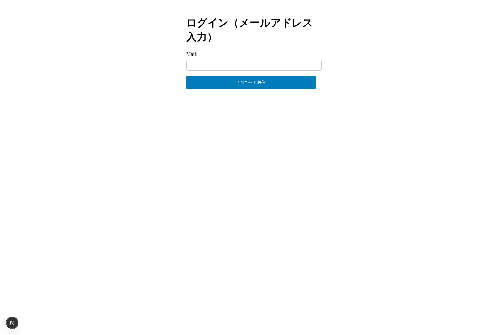

# PINコード認証システム 動作確認スクリーンショット

このドキュメントは、PINコード認証システムの動作確認手順に従って撮影したスクリーンショットを記録しています。

## 動作確認手順

### Step 1: アプリケーションにアクセス
http://localhost:3000 にアクセスし、ログイン（メールアドレス入力）ページを確認

### Step 2: メールアドレス入力とPINコード送信
- メールアドレス「test@example.com」を入力
- 「PINコード送信」ボタンをクリック
- PINコード入力ページに自動遷移

### Step 3: Mailpit でPINコード確認
http://localhost:8025 にアクセスし、送信されたメールを確認

#### Mailpit受信トレイ

#### メール詳細（PINコード: 724529）

### Step 4: PINコード入力
- PINコード入力ページでコピーしたPINコード「724529」を入力
- 「ログイン」ボタンをクリック

### Step 5: ログイン済みページ確認
- ダッシュボードページが表示される
- ログイン情報とセッション状態を確認
- 認証成功メッセージを確認

### Step 6: ログアウト確認
- 「ログアウト」ボタンをクリック
- ログインページに戻ることを確認

## 動作確認結果

✅ **全ての手順が正常に動作することを確認しました**

- メールアドレス入力からPINコード送信まで正常動作
- Mailpit経由でのメール送受信が正常動作
- PINコード認証による ログインが正常動作
- セッション管理とログアウト機能が正常動作

## 技術詳細

- **アプリケーション**: Next.js 15.3.3 + TypeScript
- **メールサーバー**: Mailpit (Docker)
- **認証方式**: PINコード（6桁数字）
- **セッション管理**: iron-session
- **テスト環境**: localhost:3000 (アプリ), localhost:8025 (Mailpit)

## 撮影日時
2025年6月16日 07:48-07:51 UTC
